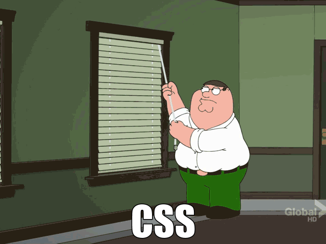

<!--

!-->
<!-- Hey Thief 🧐  Why you must copy my code ? UGGGHHHHHHHHHHHHHHHHH !-->
<h1 align="left">Hey there👋</h1>
<h3 align="left">I'm currently brewing code for <a href="https://www.vibecity.com" target="_blank" rel="noopener">Vibecity</a></h3>
<h5 align="left">For contact & discussion, shoot an <a href=mailto:7rgdev@gmail.com>email</a> to me</h5>

<!-- Hey Thief 🧐  Why you must copy my code ? UGGGHHHHHHHHHHHHHHHHH !-->

<!--  <h1 align="center" id="rg-tech-stack">Hello 🤚 &nbsp | &nbsp Hola 🖖 &nbsp | &nbsp नमस्ते 🙏 &nbsp | &nbsp Ciao 🤌 &nbsp | &nbsp Bonjour 👋</h1> !-->

<!--  !-->

<h2 align="left">Skills & Expertise</h2>
<!-- Hey Thief 🧐  Why you must copy my code ? UGGGHHHHHHHHHHHHHHHHH !-->
<table width="100%">
  <tr>
    <td align="center" width="96">
      
    </td>
    <td align="center" width="96">
      
    </td>
    <td align="center" width="96">
      
    </td>
    <td align="center" width="96">
      
    </td>
    <td align="center" width="96">
      
    </td>
    <td align="center" width="96">
      
    </td>
    <td align="center" width="96">
      
    </td>
    <td align="center" width="96">
      
    </td>
    <td align="center" width="96"> 
      
    </td>
  </tr>
  <tr>
    <td align="center" width="96">
      
    </td>
    <td align="center"  width="96">
      
    </td>
    <td align="center"  width="96">
      
    </td>
    <td align="center" width="96">
      
    </td>
    <td align="center"  width="96">
      
    </td>
    <td align="center" width="96">
      
    </td>
    <td align="center" width="96">
      
    </td>
    <td align="center" width="96">
      
    </td>
    <td align="center" width="96">
      
    </td>
  </tr>
  <tr>
    <td align="center" width="96">
      
    </td>
    <td align="center" width="96">
      
    </td>
    <td align="center" width="96">
      
    </td>
    <td align="center" width="96">
      
    </td>
    <td align="center" width="96">
      
    </td>
    <td align="center" width="96">
      
    </td>
    <td align="center" width="96">
      
    </td>
    <td align="center" width="96">
      
    </td>
    <td align="center" width="96">
      
    </td>
  </tr>
</table>

---

<!-- Hey Thief 🧐  Why you must copy my code ? UGGGHHHHHHHHHHHHHHHHH !-->

<!-- 

 !-->
<!-- -->
<!-- Hey Thief 🧐  Why you must copy my code ? UGGGHHHHHHHHHHHHHHHHH !-->
---

<!--  <h4 align="center"> Gotta go now... 🙅🏻‍♂️ </h4>
  
 
  
  
 !-->
  
 
  
  

Don't be like Peter, Let me fix your CSS

<!-- Hey Thief 🧐  Why you must copy my code ? UGGGHHHHHHHHHHHHHHHHH !-->

--- 

 © Rajat Gupta 

